# 36讲

## 目录

-   [自我倾听（1-7）](#自我倾听1-7)

-   [1. 多年前的那些工程师都去哪了？](#1-多年前的那些工程师都去哪了)

-   [2. 我要不要做管理呢？内心好纠结！](#2-我要不要做管理呢内心好纠结)

-   [3. 哪些人比较容易走上管理岗位？](#3-哪些人比较容易走上管理岗位)

-   [4. 我要不要转回去做技术呢？](#4-我要不要转回去做技术呢)

-   [5. 作为技术管理者，我如何保持技术判断力？](#5-作为技术管理者我如何保持技术判断力)

-   [6. 我这样的风格能做管理吗？](#6-我这样的风格能做管理吗)

-   [7. 我能做好管理吗，大家服我吗？、](#7-我能做好管理吗大家服我吗)

-   [角色认知(8\~10)](#角色认知810)

-   [8. 管理到底都做哪些事儿？](#8-管理到底都做哪些事儿)

-   [9. 从工程师到管理者，角色都发生了哪些变化？](#9-从工程师到管理者角色都发生了哪些变化)

-   [10. 新经理常踩的坑儿有哪些？](#10-新经理常踩的坑儿有哪些)

-   [管理规划(11\~15)](#管理规划1115)

-   [11. 我刚开始带团队，从哪里着手呢？](#11-我刚开始带团队从哪里着手呢)

-   [12. 如何界定我团队是干什么的呢？](#12-如何界定我团队是干什么的呢)

-   [13. 如何为团队设定合理的目标呢？](#13-如何为团队设定合理的目标呢)

-   [14. 如何来规划团队的组织结构呢？](#14-如何来规划团队的组织结构呢)

-   [15. 都要申请哪些资源呢？](#15-都要申请哪些资源呢)

-   [团队建设（16\~24）](#团队建设1624)

-   [16. 团队建设该从哪里入手？](#16-团队建设该从哪里入手)

-   [17. 如何提升员工的个人能力？](#17-如何提升员工的个人能力)

-   [18. 如何提升员工的工作意愿和积极性？](#18-如何提升员工的工作意愿和积极性)

-   [19. 如何兼顾团队分工的稳定性和灵活性？](#19-如何兼顾团队分工的稳定性和灵活性)

-   [20. 有什么方法可以有效提升团队凝聚力吗？](#20-有什么方法可以有效提升团队凝聚力吗)

-   [21. 如何物色和培养核心人才？](#21-如何物色和培养核心人才)

-   [22. 如何建设团队文化，营造团队氛围？](#22-如何建设团队文化营造团队氛围)

-   [23. 如何和低绩效员工谈绩效？](#23-如何和低绩效员工谈绩效)

-   [24. 如何让团建活动不再“收效甚微”？](#24-如何让团建活动不再收效甚微)

-   [任务执行(25\~27)](#任务执行2527)

-   [25. 多任务并行该如何应对？](#25-多任务并行该如何应对)

-   [26. 如何确保项目的有效执行？](#26-如何确保项目的有效执行)

-   [27. 如何让流程机制得到有效的执行？](#27-如何让流程机制得到有效的执行)

-   [管理沟通(28\~34)](#管理沟通2834)

-   [28. 管理沟通那些事儿](#28-管理沟通那些事儿)

-   [29. 沟通经常鸡同鸭讲，说不到一块怎么办？](#29-沟通经常鸡同鸭讲说不到一块怎么办)

-   [30. 如何掌控自己的情绪，以及如何管理情绪化的员工？](#30-如何掌控自己的情绪以及如何管理情绪化的员工)

-   [31. 我各方面做得都很好，就是做不好向上沟通](#31-我各方面做得都很好就是做不好向上沟通)

-   [32. 横向沟通和非职权影响力](#32-横向沟通和非职权影响力)

-   [33. 向下沟通的常见实例解析](#33-向下沟通的常见实例解析)

-   [34. 管理沟通上有哪些常见的坑儿呢？](#34-管理沟通上有哪些常见的坑儿呢)

-   [管理之路（35\~36）](#管理之路3536)

-   [35. 从空降谈管理方法论的积累](#35-从空降谈管理方法论的积累)

-   [36. 走出自己的管理之路](#36-走出自己的管理之路)

## 自我倾听（1-7）

## 1. 多年前的那些工程师都去哪了？

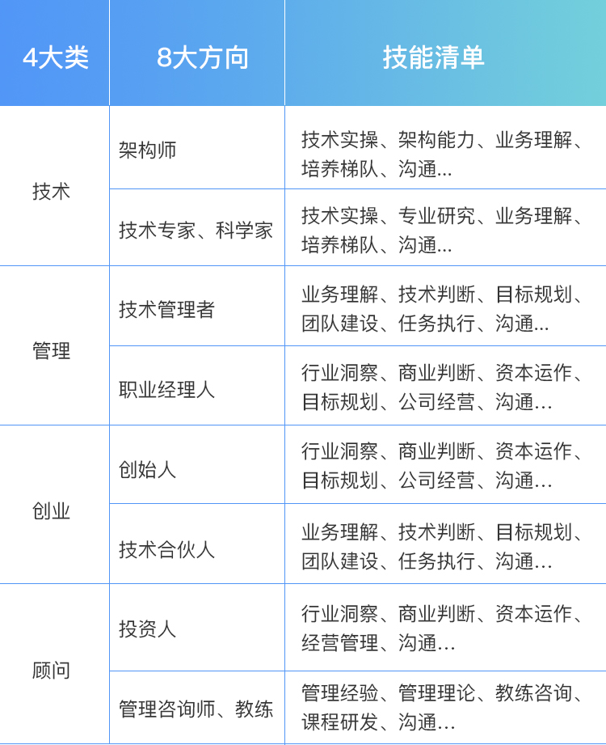

## 2. 我要不要做管理呢？内心好纠结！

以下四类说法是最为常见的：

**第一类：不得已的选择**。典型说法有：

-   “我对技术没有热情，也没有技术特长，所以只能做管理。”
-   “做技术又不能做一辈子，很多前辈都转管理了，我也要转。”
-   “没有办法，公司发展太快了，老板要求我带团队。

**第二类：别人眼里的成功**。典型说法有：

-   “如果能做到公司高管，别人都会认为我是一个优秀和成功的人。”
-   “能够做管理带团队，这样在家人眼中会很风光。”

**第三类：不辜负组织的期待**。典型说法有：

-   “上级说我适合做管理，我不能辜负他对我的期望。”
-   “公司需要我带团队，这是公司对我的信任，我一定得做好。”

**第四类：对做管理的主观遐想**。典型说法有：

-   “不用凡事亲力亲为，安排下级去做就好了，应该会轻松些。”
-   “做管理越晋升越轻松，你看高管都不坐班。”

第一个重要问题是关于“管理的价值观”的，即你是否认同管理的价值呢？

第二个重要的问题是，你是否对管理充满热情，并享受这些工作呢？

第三个重要问题是，你是否看重在管理方面的成长呢？

1. 更大的责任。

2. 更立体的视角。

3. 更灵活的思维方式。

收获

首先，你到了一个更大的平台上，你的能力和视野将得到大幅度提升。这会给你带来明显的成长感。 &#x20;

其次，你不但能力变强了，你还有团队了，你能搞定更大、更复杂的事情，做出更大的成绩。这会带给你更强的成就感。

再次，你可以带着团队做出越来越多的成就，你的团队也越来越优秀，团队成员都得到了成长，你甚至还会影响到合作团队。你的影响力显著提升了。

最后，你的能力、成绩、影响力全面提升，你得到了更多的精神和物质的回报。你所有的付出、成长和积累，都将或早或晚地换回等值的回馈。你的获得感也将得到满足

## 3. 哪些人比较容易走上管理岗位？

-   **天时：**做管理的“天时”，其实就是机会、时机、大环境、时代背景。
-   **地利：**做管理的“地利”，就是你的优势、能力，以及你所负责的工作内容。
    -   第一类是负责最全局的模块，核心是“广”。
    -   第二类是负责最核心的技术模块，核心是“深”。
-   **人和：**做管理的“人和”，就是你能否得到他人的支持。
    -   第一类，为你提供机会、平台和资源的支持。一般是你的上级
    -   第二类，为你提供陪伴和共同成长的支持。一般是和你平级的管理者
    -   第三类，为你提供指导和前进的方向。一般是你的导师、指导人、管理教练或上级
    -   第四类，为你提供情感支持，让你勇于面对困难和挫折，一般来说，是你的家人和朋友
    

## 4. 我要不要转回去做技术呢？

**问题：**

-   **转管理之前没有仔细了解过管理。**
-   **才开始做管理，还无法靠管理“安身立命”**。
-   **认为技术才是自己的“大本营”**。

**解决：**

第一个药方，专门针对“患失”来开。

首先，把技术提到更高视角来看待。

其次，换一种学习方式来掌握技术。

1.  建立你的学习机制。
2.  请教专家。
3.  共创。

最后，关于“患失”，还有一个视角，如果你是真心热爱技术，擅长用技术的思路和方案解决问题，你可以做技术型管理者。

第二个药方，专门针对“患得”开出。

首先，做管理对个人成长和个人发展来说，不会失败。

其次，一线技术管理者，即便“做不好”也并非没有“回头路”。

最后，做管理所积累的能力，完全可以迁移到做“技术带头人”或“技术 leader”这个角色上。

第三个药方，有点猛，叫做“认清现实”，做技术升维。

首先，从目标出发去看待技术。

其次，从评估的角度去看待技术。

最后，从借助自己的技术到借助大家的技术。

## 5. 作为技术管理者，我如何保持技术判断力？

如果说带团队做项目就像组装一部手机，你会越来越清楚如何把各个组件集成起来，但是你不见得会清楚每一个电子元器件内部的技术实现。

评估方法论

-   第一个维度是结果评估

    你要回答“要不要做”，希望拿到什么结果
-   第二个维度是可行性评估。
    -   一是“能不能做”
    -   二是“值不值得”
        -   首先是“人财物时”等资源投入成本
        -   其次是维护成本
        -   技术选型成本。
        -   技术升级成本。
        -   问题排查成本。
        -   代码维护成本。
        -   再次是机会成本
        -   最后是协作成本
-   第三个评估维度，即风险评估。
    -   提升自己的技术判断力
        1.  建立技术学习机制
            1.  盘点你负责的业务，需要哪些方面的技术，成立一个或几个核心的技术小组，让团队对各个方向的技术保持敏感，要求小组定期做交流和分享，这样你就可以保持技术的敏感度。
        2.  专项技术调研项目化
            1.  如果某项技术对团队的业务有重要的价值，可以专门立项做技术调研，并要求项目负责人做调研汇报。
        3.  和技术大牛交流
            1.  越是厉害的技术人，越能深入浅出地把技术讲明白，所以针对某项技术找大牛取经，也是学习的好途径。你看，虽然实际操刀的时间少了，但是你和技术大牛的交流机会多了，一方面因为你有更大的影响力了，另一方面，你和大牛有了共同的诉求，就是把技术“变现”，让技术产生价值。
        4.  听取工作汇报
            1.  因为你带的是技术团队，大部分工作都和技术相关，在读员工的周报、季度汇报时，相互探讨，也是一种切磋和学习。

## 6. 我这样的风格能做管理吗？

**管理风格，本质就是你和团队的协作方式，也就是你和团队的“位置关系”，即你站在团队的什么位置**。如果还是难以想象，你可以把带团队，看作是在驾驭一辆马车，你和这几匹马是如何协作，一起把车拉到目的地呢？

** 第一类是发号施令型。**

-   重事不重人，关注目标和结果，喜欢发号施令但不亲力亲为。
    -   特点：一位坐在马车上驾驶车辆的车夫，他不参与拉车，但是马匹的一举一动，都听命于他的指令，通常团队执行力很强，但是梯队很难培养起来。

**第二类是以身作则型。**

-   重人不重事，希望带头冲锋亲力亲为，特别在意团队成员的感受，并替他们分担工作。
    -   特点：以身作则的管理者凡事冲在最前面，是站在马匹中间，和大家一起奋力拉车的人。带不了大规模团队。

**第三类是激发辅导型。**

-   重人也重事，关注全局和方向，并在做事上给予教练式辅导和启发。
    -   特点：不会去替马拉车，但是会陪着马一起赶路，同时辅导马匹怎么样能够把路走好，以及要往哪里走。管理者团队做事，个人成长是最显著的，团队梯队也能快速完善起来。但是由于这类风格对于管理者精力消耗比较大，很难覆盖到全体成员，所以比较适用于核心梯队的培养。
    -   这有点像球场上的教练，他们不上场，但会把握比赛节奏和方向，不断给球员提供指导和反馈。所以我们把这类管理风格称为**教练式管理**。

**第四类是无为而治型。**

-   不重人也不重事，关注目标和结果，不关心过程和人员发展。
    -   特点：管理者对团队成员做事表现得非常放心，甚至让大家感觉有点漠不关心；对任务执行过程不关心，关心的只是他最在乎的目标和结果。在这类管理者团队中做事，对于不成熟的团队，成员就会变成野蛮生长；而对于成熟的团队，成员就会有很好的发挥空间和舞台，反而会得心应手

三国的故事，中国人都耳熟能详，其中有一段叫“刘备入川”：刘备在落凤坡损失军师庞统之后，就调集荆州的诸葛亮来支援西川，这时诸葛亮就需要把守卫荆州的重担交给刘备的二弟关羽。那他将会怎么样嘱托关羽呢？

我们来看看四类不同风格的诸葛亮，会如何对关羽说呢？

**指令式**的诸葛亮会说：“我把荆州托付给你，你对曹操要采取抵抗的策略，而对东吴一定要采取联合的策略，你一定要照我说的做，否则荆州肯定会丢。”

**支持式**的诸葛亮会说：“兄弟，我去支援主公，没法和你一起守荆州了，但是有什么问题你随时告诉我，我全力支持！”

**教练式**的诸葛亮会说：“云长，荆州这个重担就交给你了，如果曹操来打荆州，你打算怎么应对呢？如果曹操和孙权一起来打，你又会怎么应对呢？”听完关羽的方案，教练式的诸葛亮会给出自己的建议：“你这么做荆州比较危险，你可以参考我的策略：北拒曹操，东和孙权。”

**授权式**的诸葛亮会说：“云长，荆州就交给你了，你要确保万无一失，我相信你一定能搞定！”

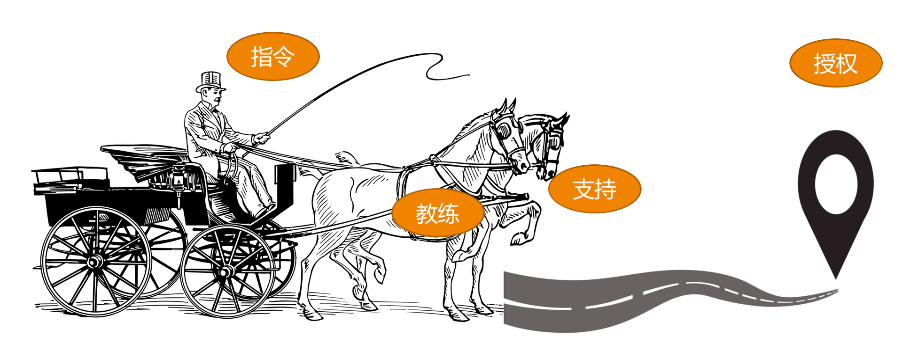

当一项工作不容有闪失，而你又是唯一熟悉、且最有掌控力的人时，一个命令式的你可能更能降低风险、达成目标。所以，命令式管理最适用于需要强执行的场景。

当一个团队特别需要凝聚力和斗志，需要攻坚的时候，一个支持式的你会促成很好的效果。所以，支持式管理特别能带团队士气和凝聚力，在带动大家热情和积极性方面很有优势。

当有一些核心人才需要重点培养，团队需要发展梯队的时候，一个教练式的你会带来明显的效果。他们不但能把事情做好，个人能力还能成长。虽然执行速度通常不会太快，但是不会偏离方向。

当团队梯队很成熟，团队成员需要发挥空间的时候，一个授权式的你能提供最恰当的管理方式。

## 7. 我能做好管理吗，大家服我吗？、

不自信的问题：

第一，管理经验不足和能力欠缺。

能力分为三个层次：知识、技能和才干，做迁移

你可以通过梳理自己可迁移的能力，提升能力自信；

第二，和团队成员对立比较。

你可以通过把自己从团队成员的对立面抽离，提升角色自信；

第三，背负着沉重的包袱。

你可以通过收集外部积极正向的反馈，提升自我认同。

**“你也许不是那个最强的人，但是你得相信，你是此时此刻做这事儿最合适的人。”**

## 角色认知(8\~10)

## 8. 管理到底都做哪些事儿？

管理主要：带人，做事，看方向。

## 9. 从工程师到管理者，角色都发生了哪些变化？

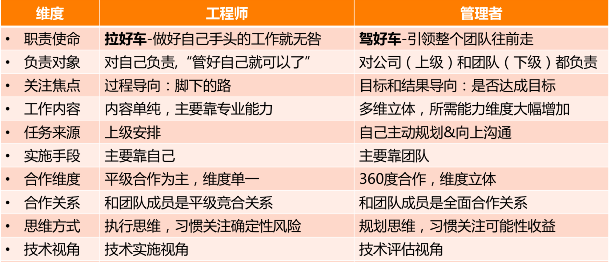

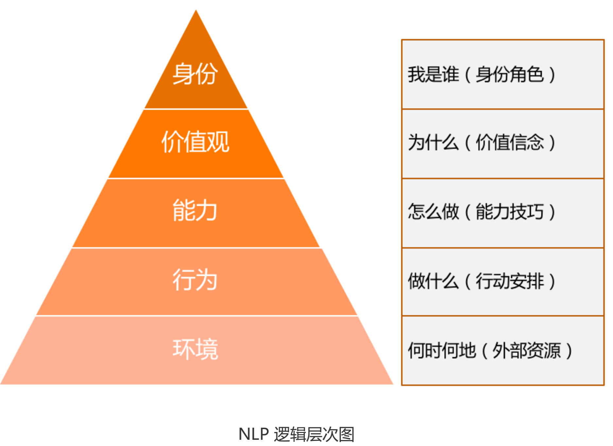

## 10. 新经理常踩的坑儿有哪些？

**过程导向、被动执行**

1.  团队方向感缺失。大家都只是着眼于手头工作，团队得不到愿景的凝聚和激励。 &#x20;
2.  团队做不出有效的业绩。因为团队没有方向感，所以结果就很难有效。 &#x20;
3.  无法带领一个团队。由于视角局限，所以还不具备带领团队的能力。

**大包大揽、唯我最强**

1.  梯队问题：大树底下寸草不生，梯队迟迟培养不起来。因为梯队的培养需要授权，需要让高潜人才有发挥空间并承担相应的责任 &#x20;
2.  激励问题：由于管理者冲得太靠前，团队成员积极性受挫，遇事往后缩。 &#x20;
3.  个人发展问题：由于得不到团队成员的有效支持，自己又忙又累，做不了更大的业务。

**带头大哥、当家保姆**

1.  不职业的管理风格和文化，这会给公司带来很大的潜在风险。 &#x20;
2.  团队没有方向，所以很难有正确的判断和决策。

**单一视角、固化思维**

1.  习惯性卡住。遇到问题和困难，很容易被卡住，到处都是绕不过去的鸿沟。 &#x20;
2.  认知层次低。由于被单一惯性思维所支配，认知层次和考虑问题的维度无法提升。 &#x20;
3.  难堪重任。由于创造性地解决问题的能力不足，难以承担具有挑战性的工作。

**自扫门前雪、固守边界**

1.  项目推进不畅，从而影响全局的结果。
2.  自我设限，因此个人成长受限。
3.  个人影响力无法扩展。因为目光和手脚都局限在团队内，所以无法在更大的范围产生影响力，也就无法成为更高级的管理者。

**患得患失**

1.  犹豫反复，无法全力以赴去做好管理，成长缓慢。
2.  对技术的看法太狭隘，从而影响技术判断力的提升。
3.  由于误判，可能会错失一个好的发展平台。

## 管理规划(11\~15)

## 11. 我刚开始带团队，从哪里着手呢？

**思维**

-   问题驱动型思维：期待着解决掉这些问题之后，事情就都好了
-   规划驱动型思维：通过理清未来的发展来理顺当前问题的带团队思路

**规划四要素**

职能：这是辆什么车

-   弄清楚它是一个背负着什么样职责和使命的团队，决定了你需要设定什么样的工作目标，并通过哪些要素来衡量你的目标；
-   决定了你需要什么样的人加入你的团队，以及需要多少；
-   还决定了你选择什么样手段，投入什么样的资源来完成工作。

目标：你要把这辆车拉到哪里去

-   首先，清晰明确的目标可以凝聚团队成员的力量，让大家劲往一处使，提升团队凝聚力； &#x20;
-   其次，清晰的目标还是执行力的必要要素，你可以回想团队取得的每一个执行出色的项目，目标一定是非常清晰； &#x20;
-   再次，清晰的目标还能提升判断力，如果你能够对某个突发状况快速决策，你一定非常清晰你当时想要的是什么； &#x20;
-   &#x20;最后，清晰的目标本身就是激励，当员工很清楚自己的工作目标，方向感很清晰的时候，他们更容易进入心流状态，即，一种投入度非常高，沉浸其中、物我两忘的工作状态。

团队：盘点一下你有哪些马，它们情况如何

-   如何升级完善自己的团队
-   思考在达成目标之后你期待收获一个什么样的团队

路径：你选择走哪条路

-   看看有哪些路可以走
-   不同的选择，各自需要多少资源预算

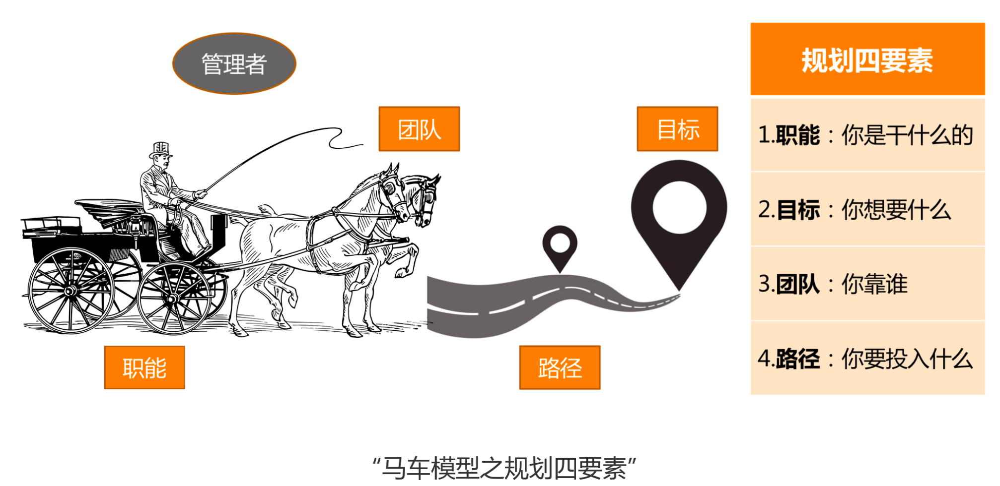

## 12. 如何界定我团队是干什么的呢？

**三个问题**

1.  公司为什么要给我这批资源（指这个团队）？是希望我产出什么？ &#x20;
2.  这个团队存在的独特价值是什么？ &#x20;
3.  你用什么维度来衡量团队的价值高低？

**团队职能**

两个层次

-   基本的职责

    职责，是团队职能的下限，即，至少要完成的工作，如果这些职责都搞不定，意味着团队的基本价值都不能体现。

    升华的使命

    使命，是团队职能的上限，即，如果我们团队做得好，就能承担更大的职责，体现出更大的价值。

    基本职责解决的是“团队生存”问题，而使命解决的是“团队幸福”问题。

**设定团队职责和使命的方法和步骤**

第一步，收集信息。

1.  向上沟通。听听上级对你团队的期待和要求，以及希望用什么维度来衡量你做得好还是不好。
2.  向下沟通。主要是和大家探讨对团队业务的看法和理解，以及对未来发展的期待，为以后的沟通做好铺垫。
3.  左看右看。主要是看职能定位的边界在哪里，最好和兄弟团队的职能是无缝对接的。
4.  你的理解。即，你对业务的理解，你对领域的理解，你对团队的期待，以及你对自己的期待。

第二步，提炼和升华。

1.  职责的提炼。基于上级的期待和要求，以及你对业务核心价值的理解，最好用上级和团队成员、兄弟部门都易于理解的语言，对职责进行简短化提炼，并尽可能长时间稳定下来。
2.  使命的升华。基于基本职责，寻找团队对于部门和公司的独特价值，并和行业发展趋势结合，设定自己的期待。
3.  确定衡量维度。一般来说，团队的职责和使命决定了衡量的维度，但是如果有明确的关于衡量维度的说法，会让员工对职责和使命有更深刻的理解。

第三步，确认和主张。

1.  确认主要是和自己的上级确认，得到上级的认同和支持
2.  主张

    2.1 在合适的场合，比如季度会、合作沟通会等，有计划、有步骤地把团队的职责和使命宣贯给大家

    2.2 团队职能的设定和宣贯是一个长期工程，不要期待一蹴而就。

## 13. 如何为团队设定合理的目标呢？

&#x20;**结果**

1.  第一，你会更加清楚目标都意味着什么，它可不是让团队有事儿干那么简单。&#x20;
2.  第二，你会掌握目标设定的要点，即使你之前没做过目标管理，你也可以实际操作了。&#x20;
3.  第三，一起探讨在团队频繁调整，公司战略都不稳定的情况下，如何管理团队目标。

**目标的意义**

1.  第一，最基本的，目标包含着你和上级的诉求，即，你们希望收获的东西。
2.  第二，目标意味着资源的有效配置。明确的目标可以让你把资源投注在有效的方向上，从“该做什么”去调配资源。
3.  第三，目标意味着执行力。
4.  第四，目标意味着凝聚力。明确的团队目标和愿景，就是提升团队凝聚力的重要手段之一。
5.  第五，目标也意味着激励。团队目标感带给员工对工作的意义感和使命感，也是提升自驱力的重要来源。

**评判一个目标是否合理：“SMART”原则**

明确性（Specific）：把目标设定到可以衡量的程度

可衡量性（Measurable）：有量

可达性（Attainable）：能不能做到

相关性（Relevant）：工作内容必定是和上、下游及上级目标相关联的

时限性（Relevant）：所有的目标都是基于一定时限的，截止时间。

**目标的描述形式**

KPI：到某时间点，什么指标达到什么数字；

KRA/OKR：到某时间点，完成什么工作，该工作实现了哪些功能或达到了哪些效果。

**坑**

1.第一类问题是基于现有资源做目标，而不是基于远方的目标往前推。

-   面对这类问题和挑战的钥匙叫做“以终为始的出发点”。

1.  第二类问题是目标不明确。

-   交代做完这些工作后，“取得了什么效果”。 因此，面对这类问题和挑战的钥匙叫做“结果导向的描述”

1.  第三类问题是目标设定好之后，自己和自己的上级都很清楚了，但是没有刻意地向团队成员来传达

-   面对这类问题和挑战的钥匙叫做“目标的向下同步”。

1.  第四类问题，就是目标总是被迫变来变去(业务目标)。

    &#x20;面对这类问题和挑战的钥匙叫做“设定专业目标”，用专业目标来增强团队的内在定力。
    1.  业务目标：简单来说就是需要完成的业务业绩目标，也就是我们常说的 KPI 和 KRA，是公司和上级对你团队的业绩要求，这类目标一般是自上而下拆解下来的，所以来自于外部，一般不容易被忽略。
    2.  专业目标：来自你团队的内在要求，一般是由你和团队自己设定的，属于自我要求，所以新的管理者往往会忽略不做，有的是想不到，有的是懒得做。而恰恰是这个内在目标的设定，最能体现你的管理价值，因为这是最能展示你的自主性的地方。
    **专业目标设定的核心步骤就两步：**
    -   选择你要提升的关键维度；
    -   设定目标，可以是量化的 KPI，也可以是非量化的 KRA。

-   例如：设置专业目标：服务端团队的稳定性和性能，半年内提升 40% 的并发性能，数据团队的准确性和安全性，功能迭代团队的高效和质量，等等，这些维度是最能体现团队核心能力及价值的。

**问题：**内在的专业目标还没有达成的时候，上级的业务目标又压下来了怎么办？这类冲突的处理办法和“重要紧急”四象限的权衡思路是一致的，**内在的专业目标属于重要的事情，而外部压过来的目标，属于紧急的事情**。

**四象限法则：**

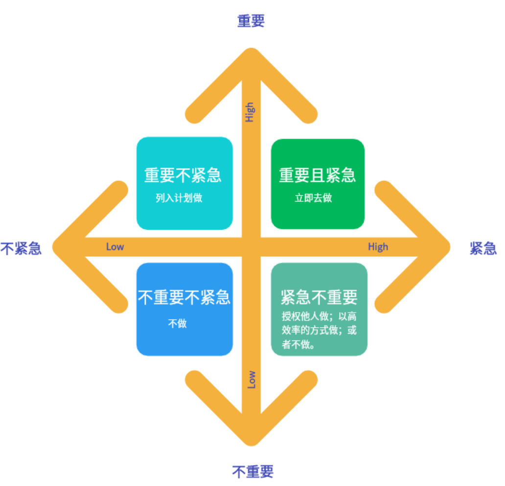

## 14. 如何来规划团队的组织结构呢？

1.  **根据团队目标的设定去梳理团队**

-   首先是团队的规模。也就是你团队有多少人，这其中要理清楚有多少人是现有的，有多少人是接下来要新增的，加起来就是你规划的团队总规模。
-   其次是团队的分工。即，你的团队都负责哪些业务，每个业务配置了多少人力，以及这些人员都如何分工，人力分布和业务目标是否匹配等。
-   最后是团队的梯队。一个团队的梯队情况代表了团队的成熟度和复原力。

1.  **从资源角度来审视团队**

-   取决于你对业务的理解，以及你希望达成的目标。
-   可以参照行业资源配比情况。

1.  **从人才培养角度来看梯队规划**

-   到下一个时间节点，你需要重点培养出哪些人，给他们什么样的平台和空间，以及你有能力提供给他们什么指导和支持，期待他们能够胜任什么职能和角色
-   团队消化能力
    -   看看你团队都有谁能带人，分别带几个比较合理。
    -   看看你团队的新人培养机制是否成熟健全。

要给上级提交一份规划报告，关于团队部分，你应该以什么形式来呈现呢？

**第一部分，绘制一张组织结构图**。这张图需要体现我前面提到的团队状态三要素：

-   **规模**，包括当前人数、预算人数和总人数。
-   **分工**，体现团队人力都分布在哪些业务上，以及各个业务都由谁来负责。
-   **梯队**，包括团队的级别和梯队分布情况。

**第二部分，列出整个团队的资源盘点情况。大体是这样的：**

-   A 级别：x 人，其中当前 m 人，预算新增 n 人；
-   B 级别：y 人，其中当前 m 人，预算新增 n 人；
-   C 级别：z 人，其中当前 m 人，预算新增 n 人；
-   ……

**第三，列出重点培养对象，以及负责业务。大体是这样的：**

-   张三，XX 业务核心工程师，到年底能完全负责 XX 业务，并能带新人；
-   李四，YY 业务负责人，到年底能带 n 人独立负责 YY 业务；
-   ……

## 15. 都要申请哪些资源呢？

**第一个问题，你是否了解资源的丰富性呢？**

-   人、财、物
-   时间
-   信息
-   权限

**第二个问题，你是否意识到手段的多样性呢？**

**第三个问题，即人力资源的持续性。通俗说就是，不是所有的人力短缺，都要通过招聘来解决。**

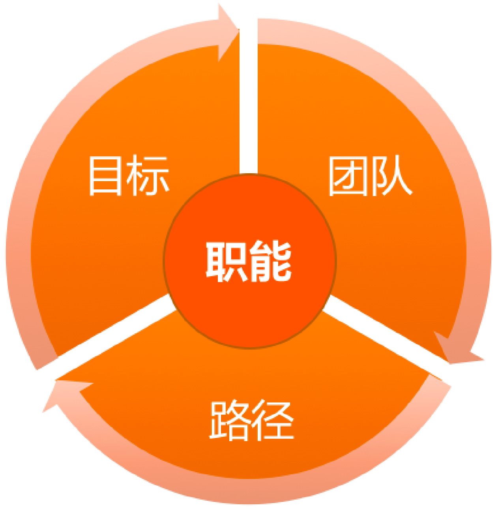

## 团队建设（16\~24）

## 16. 团队建设该从哪里入手？

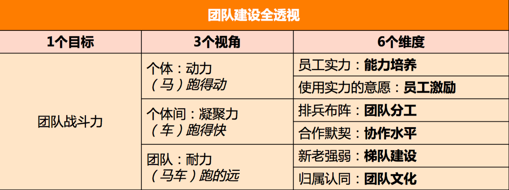

## 17. 如何提升员工的个人能力？

**提升团队战斗力的基础和前提，是提升员工的个体能力**

能力三核：知识、技能和才干三个层次。

大部分管理者希望员工提升的能力，是在“技能”这个层次，也就是员工能操作和完成的技术，比如快速学习能力、进度控制能力等。

**1、定义你所谓的员工能力；**

工作能力：人格力量、专业能力、通用能力

-   **人格力量**通常是指一个人在面对某一情形时稳定的态度和表现，比如迎难而上、坚持不懈、积极正向、主动担当等等。
-   **专业能力**很容易理解，对于技术人来说，一般就是指技术能力。
-   **通用能力**，每个人都会常常提起，但是很少有人能说清楚哪些能力算是通用能力。

**2、设计出一些可行的方法；**

-   第一类，关于帮助员工自学
    -   组织员工参加培训； &#x20;
    -   为员工推荐和购买书籍； &#x20;
    -   提供学习文档、视频等；
-   第二类，关于相互交流讨论。
    -   组织兴趣小组、读书会等； &#x20;
    -   技术分享交流会、代码评审会等； &#x20;
    -   重点工作复盘，即 case study 等；
-   第三类，关于工作实践。
    -   授权和辅导。给员工独立负责重要工作的机会，并给予辅导和反馈。 &#x20;
    -   调研工作项目化。即把调研学习的工作进行项目化管理。 &#x20;
    -   总结并内化。对于员工完成的重要工作，有必要请他们做一个工作总结，看看从中学到了什么。

对于提升员工个人能力来说，**最关键的往往不是学习的方法，而是学习的意愿**。

**3、激发员工的学习动力。**

你应该如何激发员工学习的动力和意愿呢？

-   “推”，就是给压力，推着他们学
    1.  提出明确的工作要求。比如，在 1 周内熟悉某个业务并可以做开发。 &#x20;
    2.  设置学习机制。也就是强制要求遵守学习规则，并完成学习任务。 &#x20;
    3.  peer pressure。团队整体学习成长的氛围，会给不学习的员工带来压力。 &#x20;
    4.  惩罚。包括从绩效等级、晋升机会、调薪幅度等等，对于学习意愿低的员工有适当的“关照”。
-   “拉”，就是给方向，引导他们学
    1.  树立榜样。把特别有学习意愿和成长快速的员工设为标杆人物，在团队内给予认可和奖励。
    2.  配备导师。有明确导师的新人和员工，更愿意请教问题并快速融入团队。也许有的管理者会说，“我们团队氛围很好，新人来了随便问谁都可以。”而事实上，有名义上的导师，比没有指明导师要好很多，“找谁都行”，即意味着没有人对此负责。所以，请为你团队成员配备导师，新人导师最好是团队内的，而资深员工的导师，可以找团队外更资深的人。
    3.  给地图。成熟的公司往往会有技术方面的“技能图”，作为管理者，你也可以为自己团队制定一个成长的“技能图”，并标记出重要等级。这样，团队成员就有了学习和成长的方向，知道该往哪里使劲了。
-   “放手”，就是给发挥空间，让他们自主学习。
    1.  给员工勇挑重担的机会，在风险可控的情况下，给员工承担责任的机会，让他们去负责一些有挑战的工作。。
    2.  给员工自主空间，让他们独立思考，独立决策。你的辅导仅限于在他们的决策之后给出看法和建议。
    3.  给员工信心和耐心，允许他们犯错、走弯路。因为很多经验都是踩坑儿踩出来的，所以不能一出问题就劈头盖脸一顿批，甚至是剥夺其做事的机会。

关于提升员工的能力，有两个信念特别重要.

第一是相信员工能力的差异性。

即看到差异，重视丰富性。要特别关注能力的丰富性，标准不能太单一。

第二是相信团队能力的系统性。

即欣赏差异，重视互补性。**所谓完美的团队，就是价值观相同，优势互补的团队**。所以，作为管理者，你要看到团队能力的系统性，不要把各个员工的能力割裂来看。

## 18. 如何提升员工的工作意愿和积极性？

**大部分问题：**

1.  “没有头绪，无从下手。员工激励这事，想起来就做做，忙起来就顾不上了。”
2.  “员工没有工作热情，怎么激励也提不起积极性，他们依旧我行我素。”
3.  “对员工激励效果最好的就是股权、晋升、调薪、奖金，我会向上级去争取，但是可能很难争取下来。”
4.  “没法左右加薪和奖金，只能是给员工画饼了，但是工程师对此都很无感。”
5.  ……

**原因：**

1.  激励认知不系统。不清楚激励都有哪些手段，以及如何使用，各种零散的说法让人无所适从。
2.  激励可用资源匮乏。实实在在的物质激励不受自己掌控，画大饼的精神激励，员工又不买账。
3.  激励达不到效果。虽然激励的动作都做到位了，但是并没有收到激发员工动力的效果，或者效果不够令人满意。

**第一、关于对激励的系统认知**

-   激发动力，分为**驱动力1.0**、**驱动力2.0**、**驱动力3.0**

    **驱动力1.0**主要是**马斯洛需求层次理论**

    

<!---->

-   **驱动力2.0** 主要是“**寻求奖励、避免惩罚**”，**因为无论是奖励还是惩罚，这类驱动力最大的特点是来自外部刺激**

    其中表扬要
    -   **具体**。就是表扬的内容和原因要非常具体，让员工和团队都知道他是因为哪一两点得到了认可。
    -   **公开**。这个原则很简单，公开表扬有两大好处，一个是被表扬的同学受到了更大的激励；另外一个更大的好处是，你其实告诉了团队每个人，什么样的行为和价值观在你们团队是被认同和倡导的。因此，表扬要公开。
    -   **及时**。所有的期待都有时效性，表扬及时，其实就是对员工的反馈要及时。一个不及时的表扬不但会让激励效果大打折扣，而且还会让团队成员很不理解，“这么点事，至于挖坟拿出来说吗！”
-   **驱动力3.0** 主要是指**自驱力**，那么，究竟怎么激发员工的自驱力呢？
    -   **第一，提升员工工作的自主性**。
        -   工作自由度
        -   工作内容可选择
        -   时间地点灵活
        -   方法可自主
    -   **第二，提升员工专精度，让员工持续有成长**。
        -   **明确的工作目标**
        -   **目标要略有挑战**
        -   **要能发挥其优势**
    -   **第三，给予员工意义和使命**。
        -   超越自我的渴望
        -   认可工作的意义和价值

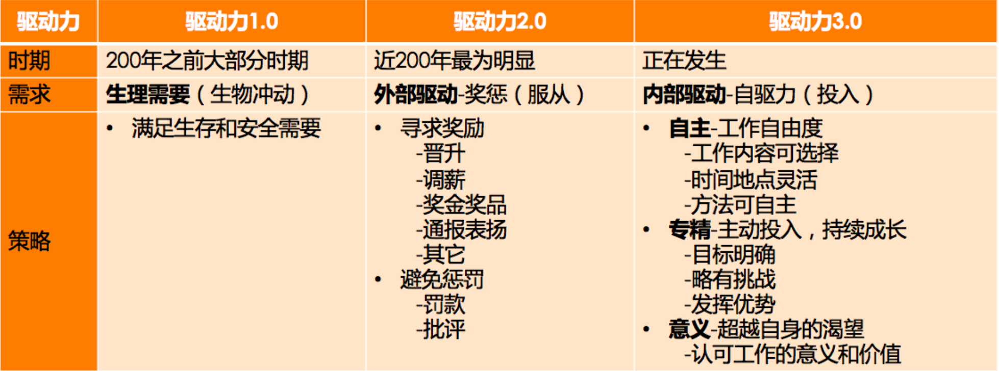

关于激发员工的自驱力，说到底还是要顺应员工对于**“工作幸福感”**的追求。

你想要提升员工工作幸福感，也可以从这五个方向去开展工作。

**正面情绪、人际关系、投入、成就、人生意义**，是通往全面幸福的五根支柱。

提升员工工作幸福感：**五个方向去开展工作**。

**第一，积极正向的情绪**。你在营造什么样的团队氛围呢？团队里是轻松愉快、互帮互助的，还是抱怨指责、死气沉沉的？现在你知道了，积极正向的情绪，本身就是提升员工工作动力、增强员工留任意愿的重要手段，那你能为此做点什么呢？

**第二，良好的人际关系**。在团队工作中，你做了哪些工作来提升员工的归属感、融入感呢？你是否设计了一些活动和机制，让彼此之间更愿意互相支持？每个团队会因为管理者的风格选择自己的有效形式，但一个常见做法是，为每位新人指定导师，你做了吗？

**第三，自主投入**。你为员工自主投入提供条件了吗？如前面我们所提及的，为员工设定清晰的目标，给他们适当的挑战，并支持他们发挥自己的优势，可以帮你的员工提升自主投入的意愿，体验到“心流”带来的愉悦。

**第四，取得成就**。迎接挑战并取得成就，是大部分工程师非常享受的事情，但是这需要一个前提，就是对于“成就”的刻画和设计。很多管理者往往缺乏这个意识，尤其对于一些长线工作，或日常的琐碎工作，员工做下来觉得没有成就感，甚至是觉得浪费时间。所以，把长线项目里程碑化，把日常工作项目化，让员工走一步有一步的成果，会提升员工的成就感。

**第五，意义和使命**。成果性的说法会让员工更清楚自己工作的价值，完成之后也会很有成就感。

以上的五根支柱，既然能提升员工幸福感，那么就可以作为激励手段的框架供使用。

**第二个问题，关于激励可用资源匮乏。**

画饼”越来越成为管理者的必备技能，只不过不宜过大，饼太大了是没有激励效果的，要注意和员工有切实的联系。而且作为管理者，只有言行一致，保持承诺一致性，才能赢得团队的信任。

**第三个问题，关于激励达不到效果。**

每一个激励方案都需要去思考和设计，把外驱和内驱结合起来，把长期和短期结合起来，把业务推进和职业幸福集合起来，把个人工作和团队使命结合起来。

**三个激励理念：**

**第一，激励要立体**。本文介绍了非常丰富的激励要素，你需要从单一的激励维度，升级为更加立体的激励体系，从而适应新职场环境的要求。

**第二，激励在平时**。你不能指望一些临时性刺激方案来做好激励，激励体系的搭建应在平时。当员工跟你提离职的时候，它就已经不再是一个激励问题了。

**第三，激励要设计**。由于每个人的业务特点不同、团队性质不同、管理风格不同、员工特征不同、问题挑战不同，所以不要迷信别人给你的激励建议，我更建议你充分考虑自己面临的实际情况，结合自己的特质和激励框架，来设计适用于自己的激励体系。

## 19. 如何兼顾团队分工的稳定性和灵活性？

-   **分工的收益**
    -   第一，为了实现规模化，为了干大事。因为干大事需要很多人
    -   第二，为了实现协作，分工是手段，协作是目的，分工和协作是不能割裂开的
    -   第三，为了实现专精
-   **分工的形式**
    -   矩阵式结构，员工按照角色被划分到不同的团队，每个团队都有自己的负责人。要做项目的时候，会有专门的项目经理来向各个角色的 leader 协调人力，然后把申请到的各个角色的人组织在一起去完成这个特定项目。
    -   BU（BUSINESS UNIT）也叫事业部制，是指做某项业务所有的人员和资源都统一调配，无论这个事业部是大是小，都角色齐全
-   **常见的误区、问题和建议原则**
    -   首先，最常见的一个分工误区，就是分工模糊。
    -   任何不以分工清晰为前提的边界模糊化，结果都会事与愿违
    -   其次，分工需要尽可能稳定，因为只有稳定的分工才能体现出分工的价值
-   **最后，虚拟组织**
    -   高效执行。虚拟团队组建的初衷一般都是为了专人专事，聚焦目标，高效执行
    -   资源配置。
    -   保持归属感。

## 20. 有什么方法可以有效提升团队凝聚力吗？

-   **如何不断提升团队的协作水平**
    -   第一个角度是建立协作机制，通过机制来约定协作的动作，以此来保证大家“动作协调”。
    -   第二个视角是提升团队凝聚力，通过提升团队成员间的信任度、认同度和默契度来降低协作成本，提高协作效率。
-   **如何来提升团队凝聚力**
    -   第一个角度，设立共同愿景。
        1.  明确你团队的职责、使命和工作目标。
        2.  管理者自己要笃信第 1 条的内容。如果不笃信，就返回步骤 1 继续提炼。
        3.  在各种合适的场合宣贯这一内容
        4.  坚持不懈地做步骤 3。
    -   第二个角度，提升员工归属。
        1.  要给他一个位置，给他一个“立足之地”，也就是要分给他一份职责。
        2.  要营造良好的团队人际关系，让彼此间形成紧密的连接。
        3.  明确亮出团队的文化价值观。
-   **第三个角度，加强相互了解。**
-   **第四个角度，共同面对挑战。**

## 21. 如何物色和培养核心人才？

**选拨和物色对象**

-   第一，要保持人才选拔和团队建设的一致性。
    1.  能力。主要是确保其个体能力和业务特点相互匹配，能力潜质是可成长的。
    2.  协作。其协作的意识和能力，和你团队的要求和期待是否匹配。
    3.  文化。其行为风格和价值观，和团队文化价值观是否匹配。
-   第二，和你相似的人才是人才，和你互补的人才是更宝贵的人才。

**培养对象**

-   第一，对齐期待，达成共识。常用方式是 IDP，即个人发展计划。把绩效计划和IDP 合二为一，前者80%，后者20%
-   第二，提供机会和发挥空间，做好授权。
    -   事前
        1.  审视初衷。管理者审视自己想要在此次授权中收获什么
        2.  明确期待。“明确期待”就是为了让培养对象清楚你对他的期待是什么
        3.  听其思路。从他的思路和方案中就大体可以判断出，他独立负责这项工作的靠谱程度如何
        4.  重要约定。即，你需要对你特别关心的事情和他做一个约定，比如在什么情况下他需要告知你。
    -   事中
        1.  了解进展。
        2.  给予支持。推崇的方式是教练式的引导和启发，而不是直接告诉答案 &#x20;
    -   事后
        1.  评估结果。针对授权对象的工作结果和表现给予有理有据的评价和及时的反馈。
        2.  洞察优势。盘点在整个授权过程中，授权对象所表现出来的突出的优势有哪些
        3.  积极反馈。就是对于授权对象的工作，一定要给出一些“正向”的反馈，主要目的是告诉他，哪些做法是你们推崇和提倡的，哪些是需要持续保持和增强的，同时也能起到激励的作用。
        4.  一条改进。就是要给出 1～2 条改进建议

**第三，建立反馈机制。**

1.  建立周期性沟通机制。
2.  review IDP。
3.  安排第二导师，给予支持和反馈。

## 22. 如何建设团队文化，营造团队氛围？

**鲜明的团队文化及价值观意义**

-   第一，效率。这是由文化的秩序性带来的效果。
-   第二，空间。这是由文化的导向性带来的效果。
-   第三，归属。这是由文化的筛选性带来的效果。
-   第四，耐力。这是由文化的延续性带来的效果。

**打造团队文化的步骤**

-   第一步，“命名它”。
    -   总结提炼
    -   命名
    -   容易传播的描述
-   第二步，“主张它”。
    -   挂在自己口头
    -   各种形式的团队内宣贯
    -   各种场合的跨团队主张
-   第三步，“追求它”。
    -   绩效计划/IDP
    -   评优晋升、带人资格
    -   团建活动设计

你在和员工约定绩效方案的时候，有没有体现团队文化和价值的内容？

你在评优和表彰员工的时候，有没有明确体现团队文化价值观？

你在选拔新人导师的时候，有没有和团队文化挂钩？

你在项目成功发布的时候，有没有总结团队文化？

你在辅导和教导员工的时候，是否有提及团队文化？

**……**

## 23. 如何和低绩效员工谈绩效？

**绩效沟通有更重要的意义和价值**

1.  对齐。一个有效的绩效沟通，会在事实信息、逻辑判断、双方意图、评价标准等多个层面上进行对标，从而达成共识。
2.  辅导。绩效沟通更重要的是通过对过去工作的回顾，让员工有更多的思考和觉察。
3.  激励。好的绩效沟通，即便对方是低绩效员工，也会通过沟通令他重燃斗志，对未来充满希望，从而达到激励的效果。

**怎么做？**

-   第一，首先需要明白的是，绩效沟通的核心并不在于谈，而在于绩效管理全过程的完整性。
    1.  绩效计划或绩效评估方案的制定。
    2.  和员工确认绩效计划。
    3.  归档并维护。
    4.  绩效评估。
    5.  绩效沟通。
-   第二，在绩效沟通之前，先摆正自己的角色和姿态。
    -   你有管理者的职业素养，有管理者的工作视角，也有令人信服的评价依据，你做出来的就是最公平和最恰当的决策。所以，你需要考虑的事情是，如何和他达成共识，期待并支持他也可以像其他同事一样，变得更加出色。
-   第三，把绩效沟通当作是承上启下的新起点，而不是末日审判。
    -   着眼未来

## 24. 如何让团建活动不再“收效甚微”？

**如何让团建活动不再“收效甚微”？**

-   团建活动四问法
    1.  第一问，关乎初衷：你是想做团建活动，还是调节放松，或是其他？
    2.  第二问，关乎角色：是你想做团建活动，还是只想配合一下助理、HR 或行政的工作？
    3.  第三问，关乎目标：你想达成团建的什么效果？默契还是文化？
    4.  第四问，关乎手段：活动方案和你的目标匹配吗？

## 任务执行(25\~27)

## 25. 多任务并行该如何应对？

**任务管理三要素**

-   事前的轻重缓急、事中的有效执行和事后的流程机制
    1.  在做事之前，我们需要回答的问题是：要做哪些事？先做哪件，后做哪件？也就是分清楚轻重缓急，也叫优先级梳理。
    2.  在做事过程中，我们要确保事情的进展按照计划推进，尽在掌握之中，也就是有效地推进执行。
    3.  在做事之后，我们要复盘做事的整个过程，并从过去的经验之中抽取一些流程机制，以便以后在类似的场景下也可以做得更好、更顺畅。
-   事前的轻重缓急
    1.  对于“计划内工作”，看收益是否足够大。收益越大就越重要，也就越需要给予相匹配的优先级、资源和关注度；收益相对不大，就放入“To do list”，作为待办任务处理。 &#x20;
    2.  对于“计划外的工作”，看损失是否足够大。损失够大，就按照紧急任务安排，以止损为核心目的；如果损失可控，就放入“计划内工作”列表。

## 26. 如何确保项目的有效执行？

**事中的有效执行四要素**

-   目标清晰，目标要清晰到可以执行的程度
-   责任明确，有唯一的总负责人对整个项目的结果负责
-   机制健全，靠机制去推进，不能完全依赖人的主动性
-   沟通到位，共识的传递和进展的通报

## 27. 如何让流程机制得到有效的执行？

**要想让员工分担我们手头上的工作，要么靠梯队，要么靠机制**

-   机制建立5部曲
    1.  首先要明确该机制要解决什么场景下的什么问题，即明确目标。
    2.  提炼应对该场景的关键点。
    3.  明确由谁来确保机制的执行，即谁在什么时候检查什么关键点。
    4.  确认操作成本。即，确认该机制对于执行者来说是可操作的，不要带来很大的操作成本。
    5.  沟通，并和其他执行人取得共识，该机制是否有效，以及能否实施
-   建立机制4原则
    1.  可操作，即简单原则。也就是说，机制要以最小的学习成本和操作成本为原则
    2.  只打关节点，即关键原则。而且这样的关键点也不能太多，以不超过 5 个为宜
    3.  明确到人，即问责原则。确认各个关键点由谁来跟进
    4.  实用原则。千万不要为了建机制而建机制，每一个机制都要有实用价值

## 管理沟通(28\~34)

## 28. 管理沟通那些事儿

-   四项工作特点
    1.  技术开发工作：使用电脑、学习语言、设计算法、开发功能、遵循规范……
    2.  项目管理工作：明确需求、制定计划、把控流程、推动执行、通报进展……
    3.  和下级合作：分配任务、跟进进展、辅导帮助、激发动力、评价结果……
    4.  和上级合作：领取任务、领会意图、提供建议、申请资源、寻求指导……
-   管理沟通框架
    -   &#x20;
    
-   目的
    1.  建立通道。即建立沟通关系和沟通渠道，说白了就是你要和谁建立沟通关系，以什么方式和频度进行沟通。
    2.  同步信息。也就是把相互不了解的信息同步给对方，让对方知悉了解此事。
    3.  表达情感。有的时候，沟通只是为了表达某种情感，此时沟通本身就成了目的。
    4.  输出影响。在工作中，希望别人能够采纳和满足自己的观点和诉求，从而达到输出自己影响的目的。
-   内容
-   通道
    1.  沟通意愿
    2.  事务需求
    3.  沟通风格
    4.  信任关系
-   影响力

## 29. 沟通经常鸡同鸭讲，说不到一块怎么办？

**沟通效率**

1.  提升沟通通道的品质；

-   所谓稳定性，就是这个通道是稳定可靠的，不会动不动就谈崩或断了联系，即使有点误会， &#x20;
    双方也能够相互包容和谅解。在这个因素上，信任关系和信任水平就起了决定性作用。
-   所谓效率，就是这个沟通通道的效果和成本之比。所谓高效，是指双方只需要非常少量的成 &#x20;
    本，就可以达成很好的沟通效果。

1.  提升沟通的技能。

    

第一，事实信息（FACT）。即，对方说了哪些事实性信息？和你掌握的信息相比有没有什么不同？

第二，感受和判断（FEELING）。即，对于上述事实信息，双方是什么样的感受和判断。需要有意识地去询问。 &#x20;

第三，意图（FOCUS）。即，对方沟通的焦点在哪里，各自为了达到什么意图和目的。

## 30. 如何掌控自己的情绪，以及如何管理情绪化的员工？

情绪管理主要针对激动和愤怒探讨。

-   认知它。了解它是怎么产生的，以及怎么发挥作用的。
    -   三层脑结构：爬行脑、情绪脑、理性脑
-   认同它。接纳并疏导自己的情绪压力，而不是压抑它。
-   觉察它。建立对情绪的觉察。
    1.  可以靠经常能关注到的一个随身物件来提示。
    2.  每天写觉察日记，反思自己在情绪管理方面是否有所失误。
    3.  可以和伙伴约定，请他帮忙提醒。
    4.  用你的重要关切来提醒，如纳入KPI。

## 31. 我各方面做得都很好，就是做不好向上沟通

-   **第一类，关于“和上级能不聊就不聊”。**
    -   问题：
        1.  “上级太忙了，我的事情好像没有那么重要 ，等他汀了再说吧。
        2.  “找不到上级，他很少在工位 ，每次碰到他都急匆匆地走开，没机会又。
        3.  “把领导交代的工作做好就行了中 ,有事没事找领导获哈 ，最讨厌有事没事讨好领导!
        4.  “总是觉得和上级有距离感，很难即到一块儿。
        5.  “每次见了上级说话都不利索 ，能用邮件沟通就写邮件吧。
        思考：
        1.  第一，沟通意愿。
            -   上级默认是需要管理者们主动向上沟通和反馈的，而非默认不需要。
            -   关于沟通的意愿，你可以首先审视一下你的角色 : 你是一名工程师还是一名管理者 ?
                然后再审视下自己的初袁 : 你是为了自己而沟通，还是为了团队去沟通 ?
        2.  第二，事务特点。
            -   根据事务的特点，比如是否重大、是否正式等，来确定沟通的方式和频次。
        3.  第三，沟通风格。
            -   如果说审视事务的特点是根据“事”来选沟通方式，那么审视沟通对象的风格，就是根据“人”  强泽沟通方式。
    -   第四，信任关系。
        -   如果说前面提到的沟通意愿、事务特点和沟通风格，都是为了鼓励你主动加强沟通的话。
        -   信任决定着你们沟通关系的稳定性，默契代表着你们沟通关系的效率和性能。

**第二类，关于“拿捏不好该不该和上级聊的分寸和尺度”。**

1.  这次沟通能给你带来什么价值？
2.  这次沟通能给上级带来什么价值？

**第三类，关于“很难领会到上级的意图”。**

-   通道品质足够高的话就靠沟通通道
-   如果沟通通道品质不高，信任和默契程度不够，就需要靠沟 &#x20;
    通工具来对齐了，沟通层次图及“3F”倾听是个不错的工具
-   用一些“回放”的句式来确认，如你看我理解的是否准确

**第四类，关于“如何影响上级的一些观点和决策”。**

## 32. 横向沟通和非职权影响力

**职权影响力**

1.  传统因素。即在社会传统意识和社会规范当中，对于上级的基本姿态是要服从的。
2.  职位因素。上级对于下级有奖惩和评价的权力
3.  资历因素。即有资历的人，在人们的眼中是值得敬重的。

**非职权影响力**

&#x20;    ** 罗伯特·B.西奥迪尼的《影响力》**

&#x20;《影响力》主要从互惠、承诺一致、社会认同、喜好、权威和稀缺几个方面探讨。

技术管理总结四个影响别人因素：信任、专业、情绪、互惠

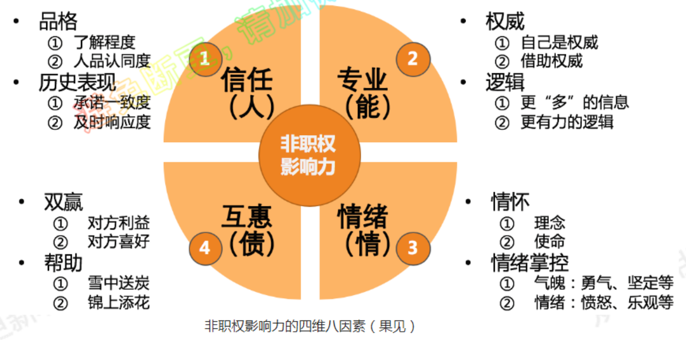

-   提升方法

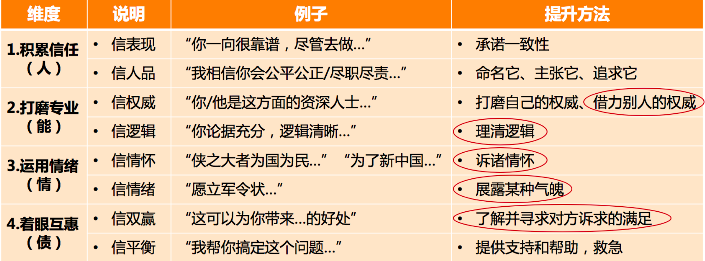

## 33. 向下沟通的常见实例解析

**第一类问题，关于“如何批评员工”**

-   建议先从“我不要……”这种意图中走出来，问 &#x20;
    问自己“我要什么”。然后再来审视采取什么手段是最合适的
-   三原则
    1.  人是 OK 的原则。即，对事不对人。批评事，不要打击人，更不能给人贴标签。 &#x20;
    2.  具体性原则。指出具体哪里做的不好，让对方容易认同。 &#x20;
    3.  面向未来的原则。体现负面的暂时性和过去时，并提供改变的“出口”。

**第二类问题，关于和下级员工沟通不顺畅**

-   内向沉默的员工
    1.  积极引导四步法

-   总聊不到一个频道上的员工
    1.  从事实、感受（判断）和意图三个层面来和对方进行频道对齐
-   捉摸不透的员工
    1.  3F
    2.  回放
-   给员工的表现进行反馈
    1.  主动积极式反馈

**第三类问题，关于如何应对“牛人”下属**

**第四类问题，关于如何应对一些“刺头”员工。**

-   评估价值

-   改变
    -   从他的“痛点”“痒点”出发，并和他一起制定“迈出第一步”的行动计划

## 34. 管理沟通上有哪些常见的坑儿呢？

**沟通视角问题**

-   沟通仅从自己出发，对管理者的角色和视角认知不够
-   管理者要做出好的业绩，就需要站高一层，站在自己上级的视角来和各个团队协同， &#x20;
    以收获共同期待的成果。并且大部分时候，帮合作团队一起做好工作，也是为了自己的业 &#x20;
    绩，你并不会吃亏。

**沟通姿态问题**

-   总是在防卫，随时准备战斗
-   工作中最好还是以做事为主，少考虑一些个人感受。如果就事论事地去沟通问题，反而会赢得更多合作者的尊重。

**沟通方式问题**

-   先给人贴标签，对人不对事
-   学会管理自己的情绪，就事论事地来讨论事情。

**沟通意识问题**

-   沟通没有形成闭环
-   对于你关心的问题，一定要去确认清楚，跟进到底，形成沟通闭环。

**沟通初衷问题**

-   只给抱怨不给建议
-   我们也许并不需要完美地解决这个问题，而只需要把一个 40 分的状态改善到 60 分就 &#x20;
    行了，或者即便没有改善到 60 分，我们也把事情往好的方向上推进了一点点，这也是我们的价值。

## 管理之路（35\~36）

## 35. 从空降谈管理方法论的积累

**空降首要做的事项回答：**

> "和几位核心下属管理者沟通,了解他们的情况、看法和期待。"
> "和上级沟通,了解一下团队的整体情况,以及团队的职责。
> "和之前负责这个团队的管理者了解团队情况,问问有没有特别:需要注意的地方。"
> "和团队每个人都聊一遍,跟大家建立联系。"
> "先评估团队的稳定性,稳定团队是首要的。"
> "先看看手头上有哪些重要的工作是要确保完成的。"

**空降成功的标准**

1.  和新同事建立起了良好的信任和协作关系，尤其是和直接上级及重要下级。 &#x20;
2.  交付出明确的、符合公司和上级期待的成果和价值。 &#x20;
3.  只要你愿意，你可以在该公司的该职位上持续做下去，上级和公司是欢迎的。

**成功三方法**

1.  第一点，诚意正心。即，准备好自己的心态。我会问自己的初心：“你到底想要的是什么？你能为上级、下级和公司带来哪些价值呢？”
2.  第二点，对齐期待。和你的直接上级去约定
3.  第三点，兑现承诺。
    -   和重要相关方建立合作关系，也就是把沟通通道先建起来。
    -   盘点团队当前工作的轻重缓急。
    -   盘点团队人员情况。
    -   管理规划。

-   管理规划,关于带着团队看方向的方法论
    1.  职能,关于如何澄清团队职能定位--回答团队核心价值的方法论
    2.  目标,关于目标设定和目标管理的方法论
    3.  团队,关于团队规划的方法论
    4.  路径,关于路径选择和成本预算的方法论
-   团队建设,关于如何带人的方法论
    1.  能力,关于如何培养员工工作能力的方法论
    2.  激励,关于如何提升员工工作意愿和积极性的方法论
    3.  分工,关于如何做团队分工和组织架构设计的方法论
    4.  协作,关于如何提升团队凝聚力和默契的方法论
    5.  梯队,关于如何进行梯队建设的方法论
    6.  文化,关于如何打造团队文化价值观的方法论
-   任务管理,关于如何做事的方法论
    1.  轻重缓急,关于如何排优先级的方法论
    2.  有效执行,关于如何做项目管理或项目执行的方法论
    3.  流程机制,关于如何通过流程机制来提升工作质量和效率的方法论
    管理沟通,关于如何有效沟通的方法论
    1.  目的,关于如何明确沟通初衷和目的的方法论
    2.  内容,关于如何确保信息有效传递的方法论
    3.  通道,关于如何建立和增进沟通关系的方法论
    4.  职权影响力,关于不断理解职能影响力的方法论
    5.  非职权影响力,关于提升和运用职权之外的影响力的方法论

## 36. 走出自己的管理之路

**价值最大化**

1.  当下视角：为你的客户找到你的价值。 &#x20;
2.  未来视角：为你的价值找到客户。

-   天时：时代机遇
    1.  第一个方面，管理工作的底层逻辑正在从管控到激发。
    2.  第二个方面，职位头衔已经不再体现职责要求，我们需要从固化的职位要求中跳脱出来，从 &#x20;
        实际的工作需求去定义自己的职责和角色。
-   地利：个人优势
    1.  技术优势。
    2.  逻辑优势。
    3.  执行力优势。
    4.  独特优势。

        当然,前面这三个是技术管理者普遍具有的优势。那作为为个人,你自己有优势呢?你可以问问自己如下这几个问题:
        > 周围的亲人朋友、上下级同事都喜欢用什么词来评价和称赞你?
        > 是什么让你与众不同?在什么重要的问题上,你与其他人有不同的看法?
        > 是什么让你取得现在的成绩?你在管理工作中突出的能力是什么?
        > 你更关注事,还是关注人?如果是关注事,你更喜欢"想事"还是"做事事"?如果是关注人,你更喜欢"支领人"?
-   人和：支持系统
    1.  上级。上级的信任值得珍惜。
    2.  伙伴。同事伙伴的陪伴力量很重要。
    3.  个人。个人的愿力是一切的源头。

**请耐心地给自己成长的时间。**

这个时代的快节奏带给我门很多的焦虑和不不小心就会错过什么。其实,职业生涯就像一场"马拉松",很漫长,以发生很多事,而你的生涯可能是20年、30年,甚至可以像我一样,生。在这么漫长的岁月中,肯定有人"先胖",有人"后胖",不不用着急很容易,因为所有的失败都不叫"失败",都只是"尚未成功"而已
次"成功"可以让你足慰平生,你就是个"成功者"。互联网拉平了世界有时间和机会去赢得自己的成功,或早或晚。

**用自己最擅长的姿势,开创属于自己的发展之路。**

不是前人走过的路习才叫什么规定好的"管理之路"是你必须要走的。因此,也就不存在用听谓的有你走过的路都是你的成长之路,这条路是你自己开创的。事实上,所有一条法则是奏效的,那就是"价值兑换",所以,做技术不重要,做管理把技术和管理当成你职业的两条腿,在职场中输出自己最大的的价值,才是真正属于你。切记,不要被别人的路限制住,也不要被某个职位限制住,没有哪个职位可以定义你的职业发展。

<https://www.tiejiang.org/tag/management>

<https://juejin.cn/post/6844904201160491016>
